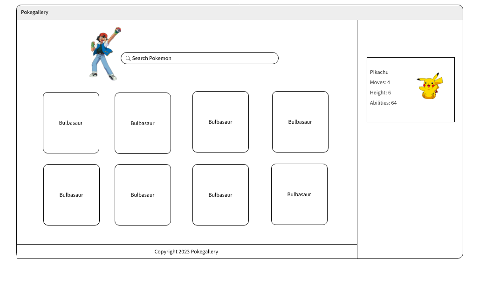

# PokeGallery

PokeGallery is a fun application that allows users to see a gallery of Pokemon, and search for specific Pokemon. The web application displays Pokemon data using the Pokemon API

### Technologies Used

- HTML5
- CSS3
- Javascript
- jQuery
- Pokemon API

### Wireframe

### Getting Started

[Click Here](https://aliciaglenn.github.io/PokeGallery/) to see the deployed app!
